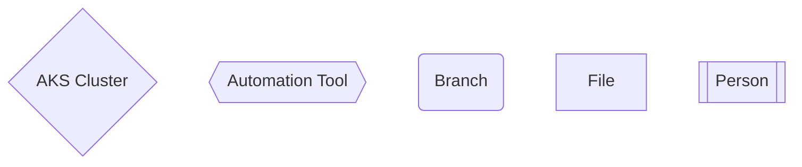
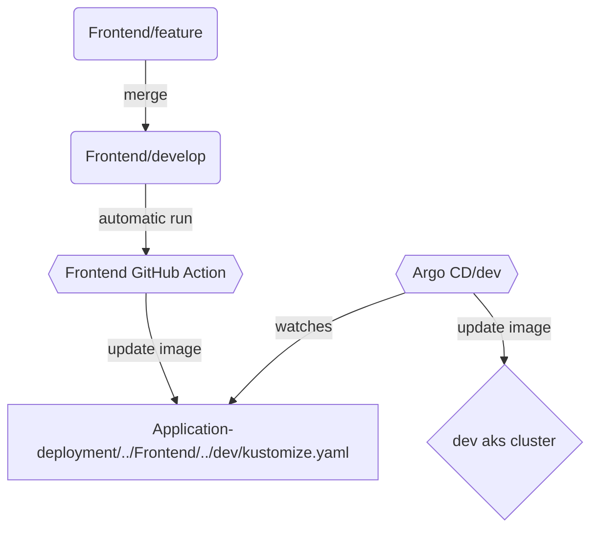
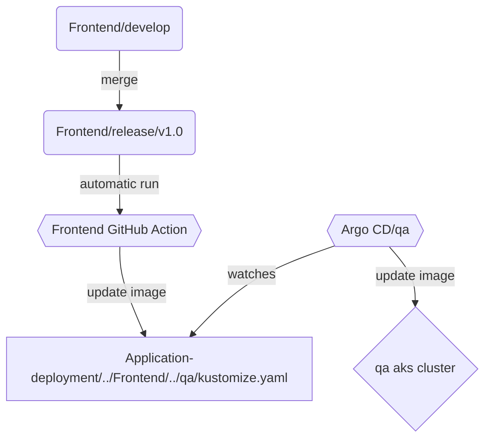
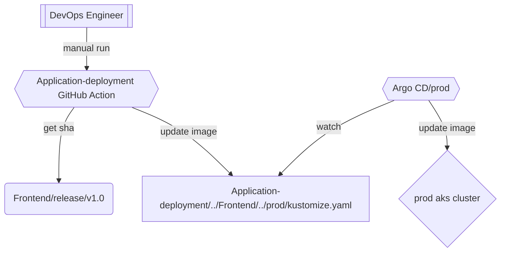

# Application Deployment
## Summary
This repository contains the following: 
- manifests that are used to deploy the Application components to our kubernetes clusters
- manifests that are used to deploy the tools which support Application
- automation which performs these deployments

## Automation
This repo is updated by the Application component repos (front end, back end, etc.) upon merges into their own develop branches.
## Legend

### Dev deployments

### QA deployments

### Prod Deployments

